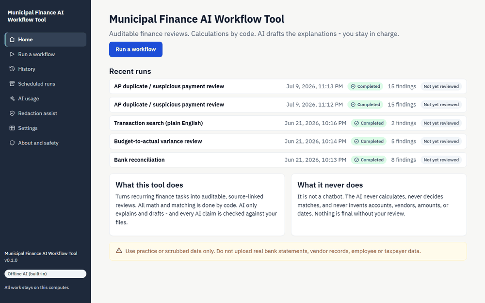
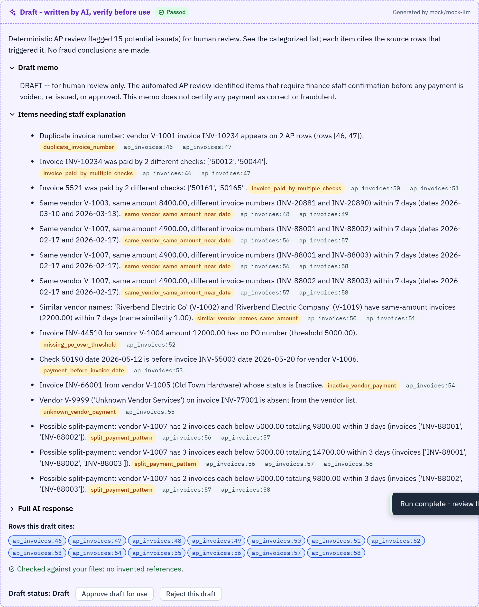
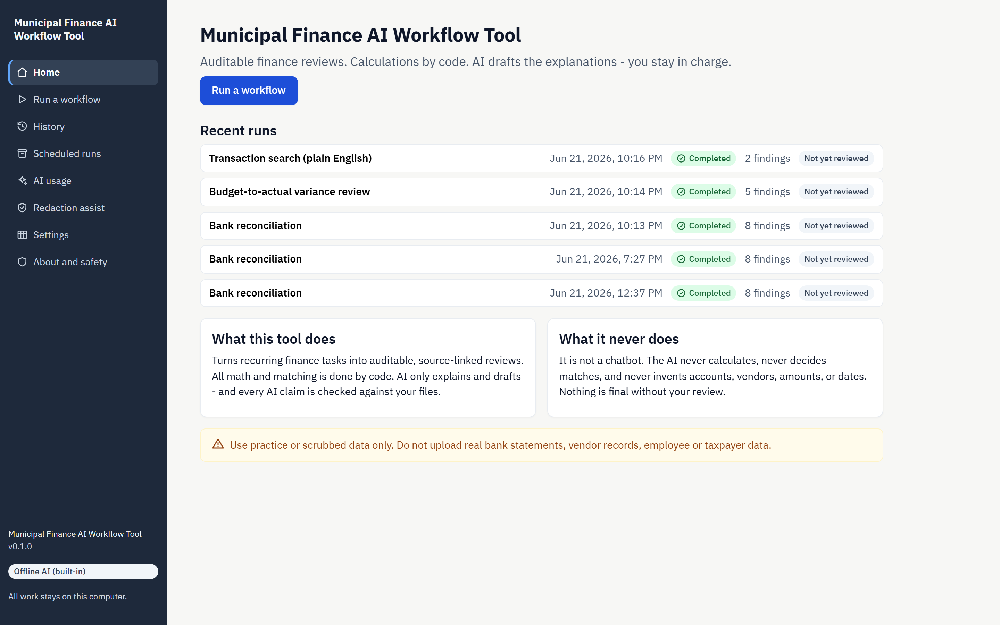
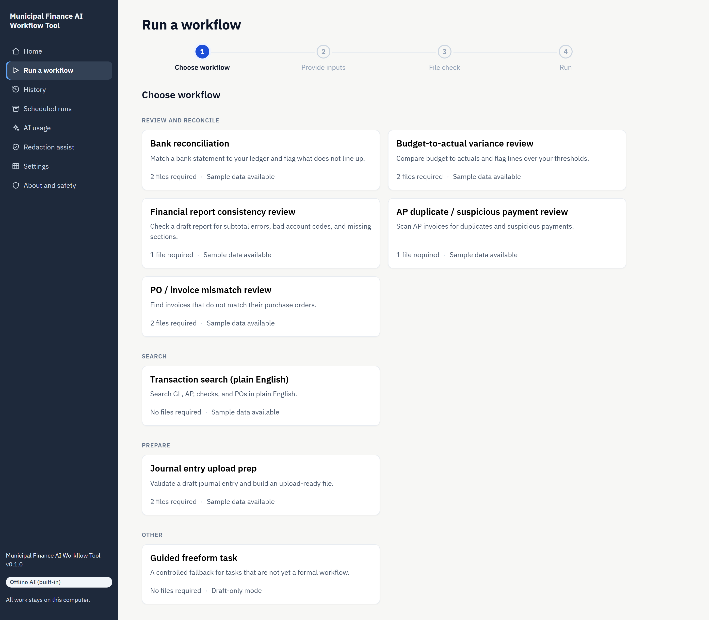
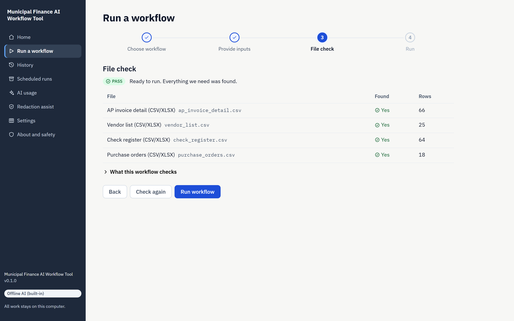
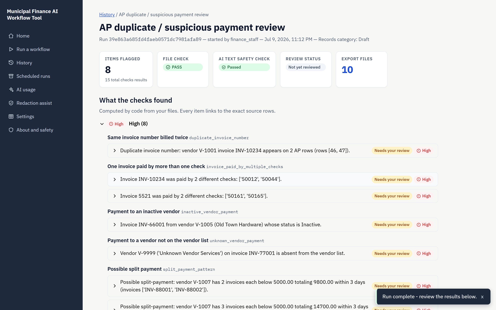
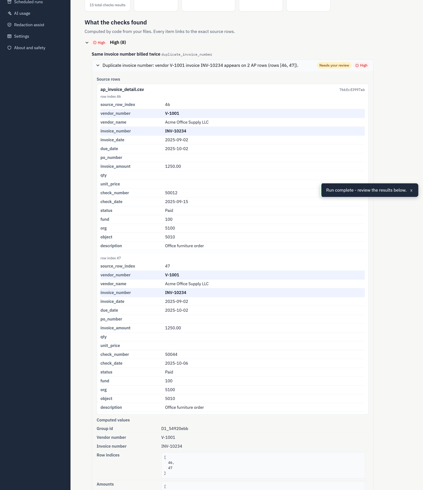
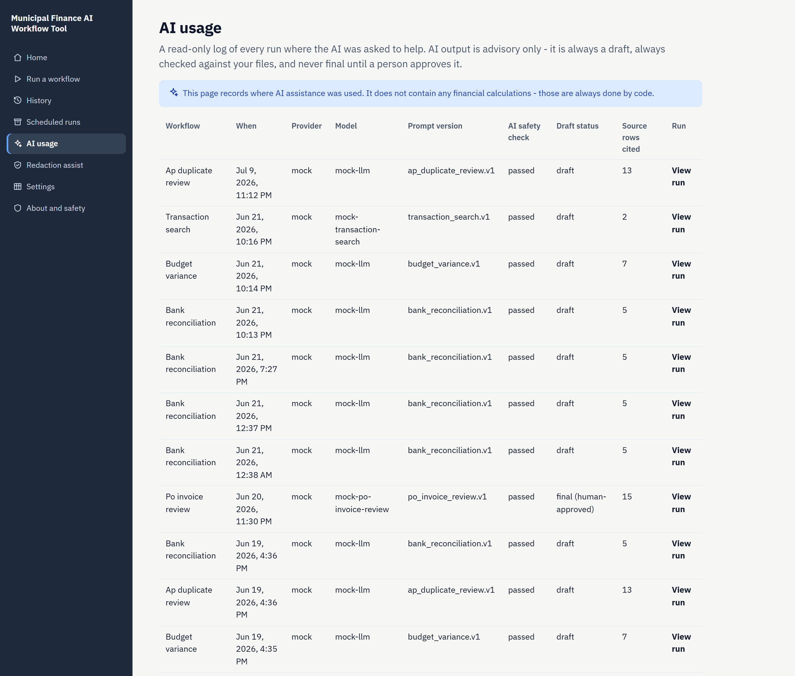

<div align="center">

# Municipal Finance AI Workflow Tool

**Auditable finance reviews. Calculations by code. AI drafts the explanations — a human stays in charge.**

A local-first tool that turns recurring, error-prone municipal finance tasks into
source-linked, reviewable workflows. It is a controlled workflow runner, **not a
chatbot**: every calculation is deterministic Python, and the model is used only
for language — drafting explanations and answering questions about a single run,
always grounded in that run's own data, validated the same way, and logged.


</div>

<p align="center">
  
</p>

> **MVP on synthetic data only.** Everything in the public repository is fabricated
> for demonstration — no real bank statements, vendors, PII, secrets, or ERP
> integrations. The project does not connect directly to a live Tyler/Munis
> installation. See the
> [full spec](docs/Project_Outline_Master.md) and [architecture decisions](docs/decisions.md).

---

## The problem

Small-city finance teams repeat the same manual, error-prone tasks every month and
quarter: reconciling a bank statement against a ledger, explaining budget variances,
checking a draft report before it goes into an agenda packet or audit. These tasks are
tedious and easy to get wrong — but they demand exactness and an audit trail.

This project was independently proposed and developed after interviews with finance
staff surfaced records-retention and auditability risks around the use of individual
AI accounts for work-related tasks.

A general chatbot is the wrong tool. Finance staff can't trust a black box that might
invent an account number or miscalculate a variance, and auditors need to see where
every number came from. The users here are **non-technical**, need no prompt
engineering, and distrust black-box financial outputs.

## The core idea: a hard trust boundary

The whole design rests on one line:

> **Deterministic code does all the math and matching. The LLM only drafts language and
> must cite source rows. Every run is logged, validated, and exported for a human to approve.**

| | Deterministic core (Python) | The model |
| --- | --- | --- |
| **Does** | Parse, clean, normalize, match, compute every variance/total, validate, track source rows, export, audit-log | Explain, summarize, draft, classify, flag — in plain language |
| **Never** | Delegates a calculation or a match to the model | Calculates, decides a match, or invents an account/vendor/amount/date |

This is enforced two ways. Each workflow builds the LLM prompt **only** from the
deterministic findings, and a deterministic validation layer checks every model
response for invented references and for numeric claims not present in the findings —
flagging or rejecting anything that fails. The AI's output is always labelled a **draft**
and shown in a visually distinct trust boundary until a human approves it.

<p align="center">
  
</p>

<div align="center"><sub>Every AI claim cites its source rows · validated against the files · <b>Approve</b> or <b>Reject</b> before it counts.</sub></div>

The model runs on a built-in **mock provider by default** — deterministic, no API key,
no internet — so the entire tool runs offline. A real OpenAI-compatible or Anthropic
provider is available opt-in (see [Configuring a real LLM](#configuring-a-real-llm)) and
passes the exact same guardrails.

## A run, end to end

The React console guides a non-technical user through four steps — **upload → file check →
run → review** — with progressive disclosure so they're never staring at a blank form.

<table>
  <tr>
    <td width="50%"><br><sub><b>Home</b> — recent runs, what the tool does and never does, offline badge.</sub></td>
    <td width="50%"><br><sub><b>Choose a workflow</b> — eight review/search/prepare workflows, each with sample data.</sub></td>
  </tr>
  <tr>
    <td width="50%"><br><sub><b>File check (preflight)</b> — profiles the files before running; PASS / PARTIAL / FAIL.</sub></td>
    <td width="50%"><br><sub><b>Review</b> — summary strip, deterministic findings, AI safety check, exports.</sub></td>
  </tr>
</table>

Expanding any finding shows the **actual cell values** of every source row it cites —
grouped by document, with the driving fields highlighted and full provenance (file name,
absolute row index, recorded SHA-256 hash) on every row. The UI never computes anything;
it only renders what the backend decided.

<p align="center">
  
</p>

Every AI interaction — workflow drafts and run-scoped Q&A alike — lands in a searchable
**AI usage log** with its model, prompt-template version, validation status, and
draft-vs-approved state: a CPRA-style review surface for AI usage.

<p align="center">
  
</p>

## Supported workflows

Eight workflows share one pipeline and are runnable end-to-end from the CLI, the API,
the React console, and the legacy Streamlit app — all on bundled synthetic data.

| Workflow | What the code does (deterministic) | What the AI does |
| --- | --- | --- |
| **Bank reconciliation** | Match a bank statement to the ledger by amount/date with tolerances; flag unmatched items, timing differences, duplicates; compute totals. | Explain unmatched items, citing source rows. |
| **Budget-to-actual variance** | Join budget to actuals; compute dollar and percent variance; flag lines over threshold and missing accounts. | Draft variance commentary referencing flagged rows. |
| **Report consistency review** | Check a draft report for subtotal mismatches, invalid codes, duplicates, missing sections, large prior-version changes. | Explain each issue; draft a review checklist. |
| **Transaction search** | Parse plain English into a schema-validated `SearchCriteria`; apply as deterministic pandas filters over GL/AP/check/PO exports. | Translate the query to structured JSON; summarize matches. |
| **AP duplicate / suspicious payment** | Eight checks (D1–D8): duplicate invoices, same-vendor/amount near-date pairs, similar vendor names, missing PO, payment-before-invoice, inactive/unknown vendor, split payments. | Summarize flagged issues; draft review notes — never concludes fraud. |
| **JE upload prep** | Validate a draft journal entry against the chart of accounts and fiscal period; produce an upload-ready workbook **or** a blocking error report. Fail-closed. | Draft a validation summary; never edits the workbook. |
| **PO / invoice mismatch** | Nine checks (P1–P8 + P3b) joining PO and AP exports: invoice-over-PO, wrong vendor, missing/closed PO, price/qty mismatch, received-vs-invoiced. | Summarize mismatches; draft review notes — never declares an invoice improper. |
| **Guided freeform** | A structured (not chat) fallback routing ad-hoc tasks through the same logging and validation; **fails closed** unless sensitivity is confirmed. | Produce a source-linked DRAFT for human review. |

Four workflows consume **Tyler/Munis-style ERP exports** through a deterministic
normalizer (`src/ingest/tyler.py`) with header-overlap dataset detection, SHA-256 input
hashing, source-row tracking, and `Decimal` amount parsing. Details in
[`docs/tyler_assumptions.md`](docs/tyler_assumptions.md).

### Fail-closed preflight

Before any workflow runs, a deterministic **preflight layer** profiles the files against
the workflow's declared capability and returns one of three statuses:

- **PASS** — inputs satisfy the workflow; it runs normally.
- **PARTIAL** — it runs the supported checks, but conditions it doesn't fully handle
  (e.g. a likely sign-convention mismatch) are flagged for human review; the AI may only
  explain the deterministic findings.
- **FAIL** — a required file/column is missing or unparseable; the workflow does **not**
  run, **the LLM is never called**, and a structured report with next steps is returned.

The model never "takes over" failed workflow logic. Full rules in
[`docs/workflow_capabilities.md`](docs/workflow_capabilities.md).

## Architecture

```text
  ┌──────────────────────────────────────────────────────────────────────────┐
  │  DETERMINISTIC CORE   (src/core, src/workflows, src/ingest, src/llm)      │
  │                                                                          │
  │  input files (CSV / Excel)                                               │
  │        └─▶ parse → clean → normalize → match / compute / check           │
  │                → deterministic findings + source-row refs                │
  │        └─▶ AI-assisted drafting (LLM, mock by default)                   │
  │                explains / summarizes / drafts ONLY · cites rows          │
  │        └─▶ validation (deterministic)                                    │
  │                reject/flag invented refs, numbers not in findings        │
  │        └─▶ run ledger (SQLite) + append-only audit log                   │
  │        └─▶ export packet: findings.csv, review_packet.md, manifest.json  │
  └──────────────────────────────────────────────────────────────────────────┘
            │                                    │
            ▼                                    ▼
     ┌──────────────┐                    ┌──────────────────┐
     │  FastAPI seam │                    │  Streamlit app   │
     │  (api/)       │                    │  (app/) — legacy │
     │  thin HTTP    │                    │  shares the same │
     │  adapter,     │                    │  ledger + audit  │
     │  no logic     │                    └──────────────────┘
     └──────────────┘
            │
            ▼
     ┌────────────────────────────┐
     │  React / Vite / TS console │   guided wizard · progressive disclosure
     │  (frontend/)               │   human review + export
     │  NEVER calculates —        │   renders backend data only
     │  renders only              │
     └────────────────────────────┘

  CLI (cli/run_workflow.py) drives the core directly — same pipeline, same
  ledger, same audit log as the API and Streamlit.
```

The **responsibility split** is what makes the output trustworthy: every number on
screen came from deterministic code, not the UI.

| Layer | Owns | Never does |
| --- | --- | --- |
| Deterministic core | Parsing, cleaning, all calculations, matching, validation, source-row tracking, preflight, exports, audit log | Delegates logic to the LLM or UI |
| FastAPI seam (`api/`) | HTTP transport, file handling, typed contracts, orchestration | Business logic, LLM calls, recalculation |
| React console (`frontend/`) | Rendering API data, routing, review actions, downloads | Computes **any** value — even a display-only sum is forbidden |

> **Why FastAPI + React after a Streamlit MVP?** Streamlit proved the workflow logic,
> audit model, and trust boundaries end-to-end and still serves developers. But its dense,
> form-heavy layout makes it hard for non-technical staff to tell what step they're on and
> what the AI wrote versus what the code found. The guided console replaces that with a
> four-step wizard, progressive disclosure, explicit AI/deterministic separation, and a
> run-scoped "ask about this run" assistant. Streamlit is retained as the legacy/dev
> surface and shares the same ledger, so runs appear in both.

## Tech stack

**Backend** Python 3.11+ · FastAPI · pandas · pydantic v2 · SQLite (run ledger) · openpyxl
**Frontend** React 18 · TypeScript · Vite · React Router
**Testing** pytest (758) · vitest (45) · Playwright (e2e)
**AI** mock provider by default (offline, deterministic); opt-in OpenAI-compatible / Anthropic Messages providers behind one interface

## Getting started

Requires **Python 3.11+** and **Node 24+**. Runs fully offline by default. On Windows the
project uses a local venv at `.venv\Scripts\python.exe`.

### Deployment status

As of July 2026, the system has been piloted with finance staff as a local,
single-user MVP. The deployment path described below serves the built React console
and FastAPI backend from one local process for evaluation and demonstration. It is not
a hosted multi-user production deployment, and the public repository contains
synthetic data only.

```bat
REM 1. Backend
python -m venv .venv
.venv\Scripts\python.exe -m pip install -e .

REM 2. Frontend (built bundle served by the API)
cd frontend
npm install
npm run build
cd ..

REM 3. Run — one server serves the console + API
.venv\Scripts\python.exe -m uvicorn api.main:app --port 8000
REM open http://127.0.0.1:8000
```

**Fastest path for a non-technical user** (after one build): double-click
`scripts\launch_console.cmd` — it checks the venv/build, starts the server, waits for
health, and opens the browser.

**Try it from the CLI** — no frontend build needed:

```bat
.venv\Scripts\python.exe cli\run_workflow.py list
.venv\Scripts\python.exe cli\run_workflow.py ap-duplicate-review --sample
.venv\Scripts\python.exe cli\run_workflow.py bank-reconciliation --sample --export out\bank
```

<details>
<summary><b>Run modes, dev server, and reproducible installs</b></summary>

| Mode | How to start | URL |
| --- | --- | --- |
| API only (no build) | `uvicorn api.main:app --port 8000` | `http://127.0.0.1:8000/api/...` |
| Dev (hot-reload) | `npm run dev` in `frontend/` + API on 8000 | `http://localhost:5173` (proxies `/api` → 8000) |
| Single-server (prod-like) | `npm run build` then start the API | `http://127.0.0.1:8000` |

`frontend/dist/` is a **build artifact** — gitignored, never committed. When it exists,
the API mounts it at `/`; `/api/*` routes always take priority. The API runs fine with no
dist present (that's the normal dev/CI state).

For byte-for-byte reproducibility use the pinned lockfile instead of `-e .`:

```bat
.venv\Scripts\python.exe -m pip install -r requirements.txt
```

`requirements.txt` pins every transitive version, frozen from the known-good Python 3.14
environment; `pyproject.toml` `[project.dependencies]` is the source of truth for direct
deps. A quick API smoke check:

```bat
curl http://127.0.0.1:8000/api/health
REM -> {"status":"ok","app":"municipal-finance-ai","version":"0.1.0","llm_mode":"mock"}
```

See [`docs/frontend/api_contract.md`](docs/frontend/api_contract.md) for the full endpoint
reference.
</details>

<details id="configuring-a-real-llm">
<summary><b>Configuring a real LLM (opt-in)</b></summary>

The mock provider is the default and needs no configuration. To use a real provider, set:

```bat
set LLM_MODE=real
set LLM_API_KEY=<your-key>
REM Optional overrides:
set LLM_BASE_URL=https://api.openai.com/v1/chat/completions
set LLM_MODEL=gpt-4o
set LLM_PROVIDER=openai
```

Without `LLM_MODE=real` (or with no key) the system uses the mock — the real provider
raises a clear error before any network call rather than fabricating output. It defaults
to an OpenAI-compatible `/chat/completions` endpoint; an **Anthropic Messages** preset
(`anthropic_messages_transport`) is included in `src/llm/provider.py`. All validation and
source-citation guardrails apply identically on the real path, which is never exercised by
the test suite and is not required for any demo.
</details>

## Testing

```bat
.venv\Scripts\python.exe -m pytest          REM 758 backend tests
cd frontend && npm test                     REM 45 frontend tests (vitest)
cd frontend && npx playwright test           REM optional browser e2e (Chromium)
```

The backend suite covers the preflight/capability layer, per-workflow messy-data
fixtures, the four Tyler-era workflows, the Tyler normalizer, CLI/registry integration,
and the API endpoints. An evaluation harness runs known-answer datasets for each workflow:

```bat
.venv\Scripts\python.exe -m src.eval.harness --out runs/eval_report.json
```

**Measured result:** the harness runs all seven tabular workflows end-to-end on synthetic
data, passing **7/7 known-answer checks with 0 LLM outputs rejected** on the mock path —
e.g. bank reconciliation yields 4 matched / 1 timing difference / 3 unmatched across 13
transactions; AP duplicate review flags exactly 15 findings across D1–D8; JE upload prep
produces an upload-ready workbook with 2 round-dollar warnings; PO/invoice review flags 9
exceptions.

## Limitations

Deliberate scope boundaries of this MVP — not bugs:

- **Local, single-user, no auth.** No accounts, roles, or access control. The role
  selector is presentation-only (reorders findings; never hides or deletes).
- **No real ERP integration.** All data is local CSV/XLSX. Tyler/Munis column aliases are
  modeled on observed export shapes and unvalidated against a live system. The public
  repository does not connect directly to a live Tyler/Munis installation — see the
  assumptions register in [`docs/tyler_assumptions.md`](docs/tyler_assumptions.md).
- **Synchronous execution, no streaming.** Workflows run in the request handler (seconds
  on synthetic data); a large real dataset would need a task queue.
- **PDF export is text-only**; **redaction is a regex prototype**, not a compliance tool.
- **No vector DB / RAG.** Reference data loads from files at run time — none is needed at
  this scale.

## Synthetic data disclaimer

Everything in this repository uses **synthetic data only**. There are no real bank
statements, vendor records, employee or taxpayer data, credentials, PII, secrets, or ERP
integrations anywhere in the public project, and it does not connect directly to a live
Tyler/Munis installation. "City of Riverbend" and all vendors, invoices, checks, POs,
and amounts are fabricated. **Do not load real sensitive data into this MVP.**

## Engineering decisions

- **Constrained the MVP on purpose.** Deterministic code does all financial logic; the LLM
  is limited to explanation and drafting; no vector DB, no multi-agent system, no real ERP
  integration, no production auth. Mock-LLM mode is the default so the whole tool runs
  offline and every test runs on the mock path.
- **One pipeline, cleanly separated.** Ingest → normalize → deterministic analysis → LLM
  assist → validate → human review → export → audit log. UI, CLI, persistence, validation,
  and the LLM wrapper are kept apart, so workflow modules never touch Streamlit, FastAPI,
  or provider code.
- **Validation as a first-class layer.** A deterministic checker rejects or flags any LLM
  claim not backed by the findings; an eval harness proves it on known-answer datasets.
- **Why it matters.** Keeping the math deterministic and the model language-only is what
  makes the output auditable and trustworthy — and the same constraint keeps the system
  honest about its limits and straightforward to extend (RAG, more adapters, orchestration)
  without rewriting the core.

---

<div align="center"><sub>Portfolio MVP · synthetic data only · built to demonstrate an auditable, trust-bounded approach to AI in government finance.</sub></div>
